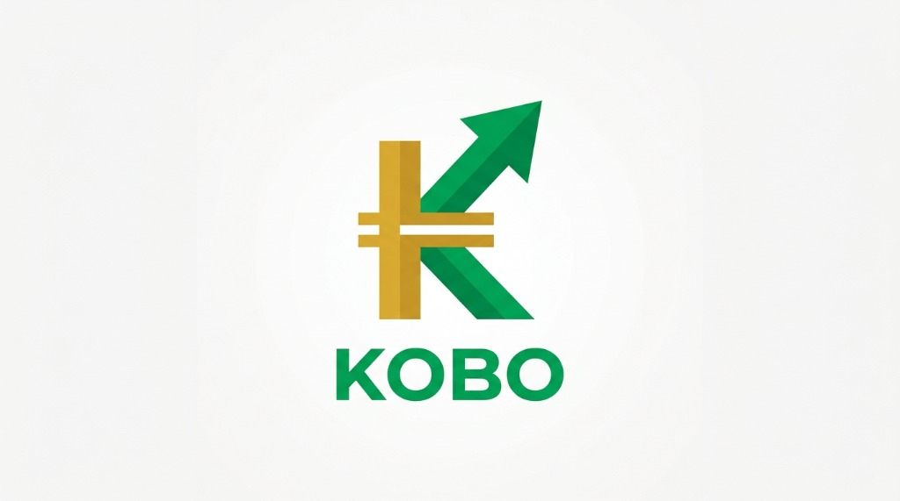

# KOBO Launchpad 🇳🇬

> **Naira-Native (cNGN) Web3 Memecoin Protocol & Bonding Curve AMM**



---

## 🌟 Overview

**KOBO Launchpad** is a decentralized, Naira-native memecoin protocol built for Web3. It allows users to launch memecoins priced and settled in **cNGN** (Nigeria's regulated Naira stablecoin) with 100% fair-launch bonding curves.

When a launched token raises **50,000 cNGN**, its smart contract automatically locks reserve liquidity and triggers automated migration to a **Uniswap V2 AMM pool**.

---

### ✨ Key Features

- **🇳🇬 Naira-Native Settlement**: Prices and trades settled 1:1 in cNGN (Nigerian Naira stablecoin).
- **📈 Constant-Product Bonding Curves**: Fair pricing formula (\(k = x \cdot y\)) preventing presales or insider allocations.
- **🛡️ Automated DEX Migration**: Automatic liquidity lock and migration to Uniswap V2 AMM pools upon reaching 50,000 cNGN raised.
- **🏦 Instant NGN Bank Ramp Simulator**: Seamless 1:1 NGN bank deposit and withdrawal simulation for quick onboarding.
- **📊 DexScreener/Birdeye Analytics**: Live Market Cap, FDV, 24h Volume, Buy/Sell Ratio, VWAP, Price Performance, Holder Distribution, and Security Audits.
- **🔐 Embedded Web3 Wallets**: Dynamic Auth SDK integration for social & email logins and non-custodial wallet creation.

---

## 📜 Deployed Smart Contracts (Arc Testnet - Chain ID `5042002`)

| Contract | Address | Explorer |
| :--- | :--- | :--- |
| **cNGN Stablecoin (Mock)** | `0x21c494f10E7a10C1792D0Ba68bC8b8cFC6E554C7` | [View on ArcScan](https://testnet.arcscan.app/address/0x21c494f10E7a10C1792D0Ba68bC8b8cFC6E554C7) |
| **Token Factory** | `0x4Ca9A69ff8dBF37819d21DB37260142416796D72` | [View on ArcScan](https://testnet.arcscan.app/address/0x4Ca9A69ff8dBF37819d21DB37260142416796D72) |
| **Migration Router** | `0x474c3422E93830cdE64c85AE842150497e8216D8` | [View on ArcScan](https://testnet.arcscan.app/address/0x474c3422E93830cdE64c85AE842150497e8216D8) |
| **Featured Token ($JOFF)** | `0x54Dc524dC245E7bCD39ca9d6F6Fd4A04A1130cE2` | [View on ArcScan](https://testnet.arcscan.app/address/0x54Dc524dC245E7bCD39ca9d6F6Fd4A04A1130cE2) |

---

## 🏗️ Repository Architecture

```text
kobo-launchpad/
├── contracts/       # Hardhat TypeScript Smart Contracts & Unit Tests
│   ├── src/         # BondingCurve.sol, TokenFactory.sol, MigrationRouter.sol
│   └── test/        # Bonding curve & DEX migration integration tests
├── backend/         # Node.js Express REST API & Fiat Ramp Adapter
│   └── src/         # Token indexer, fiat deposit/withdrawal endpoints
└── frontend/        # Next.js 14 App Router, Tailwind CSS & Real-Time Metrics
    ├── public/      # Brand assets & favicons
    └── src/         # Components, Pages & Metrics Math Engine
```

---

## ⚡ Quickstart & Local Setup

### 1. Clone Repository & Install Dependencies

```bash
git clone https://github.com/YOUR_USERNAME/kobo-launchpad.git
cd kobo-launchpad
```

### 2. Run Smart Contract Tests

```bash
cd contracts
npm install
npm test
```

### 3. Run Backend API Server

```bash
cd ../backend
npm install
npm run dev
```
> Running on `http://localhost:4000`

### 4. Run Next.js Frontend App

```bash
cd ../frontend
npm install
npm run dev
```
> Open `http://localhost:3000` in your browser.

---

## 🚀 Live Deployment Guide

### Deploying Frontend to Vercel

1. Push this repository to **GitHub**.
2. Go to [Vercel Dashboard](https://vercel.com/new) and click **Import Repository**.
3. Set the **Root Directory** to `frontend`.
4. Click **Deploy**.

---

## 📄 License

MIT License © 2026 KOBO Protocol Team
